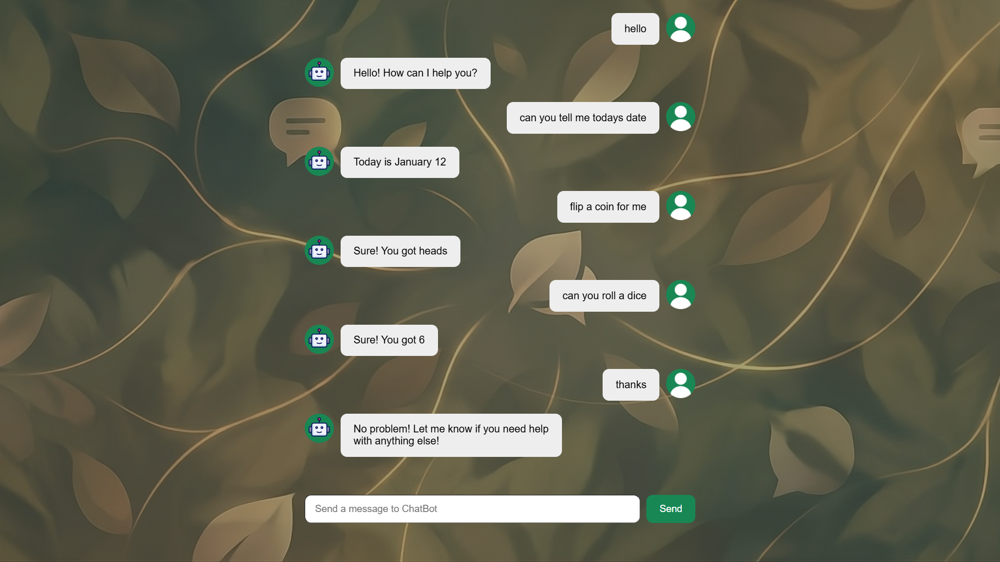

# 🤖 ChatBot Web Application

A simple and interactive chatbot web application built using **HTML, CSS, JavaScript, and React (via CDN)**.  
This project demonstrates basic chatbot logic, React components, and clean UI design.

---

## 🚀 Live Demo

---

## 🛠️ Technologies Used

- HTML5
- CSS3
- JavaScript (ES6)
- React (CDN)
- Babel

---

## 🚀 Features

- User & bot message interface
- Auto-scrolling chat window
- Responsive UI
- Simple chatbot response logic
- React functional components
- Clean message alignment with profile icons

---

## 📸 Preview

---

## 👨‍💻 Author
Jatin Kumar  
ECE Student, NIT Jalandhar

